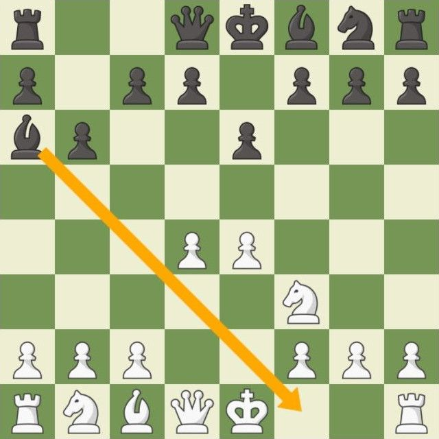
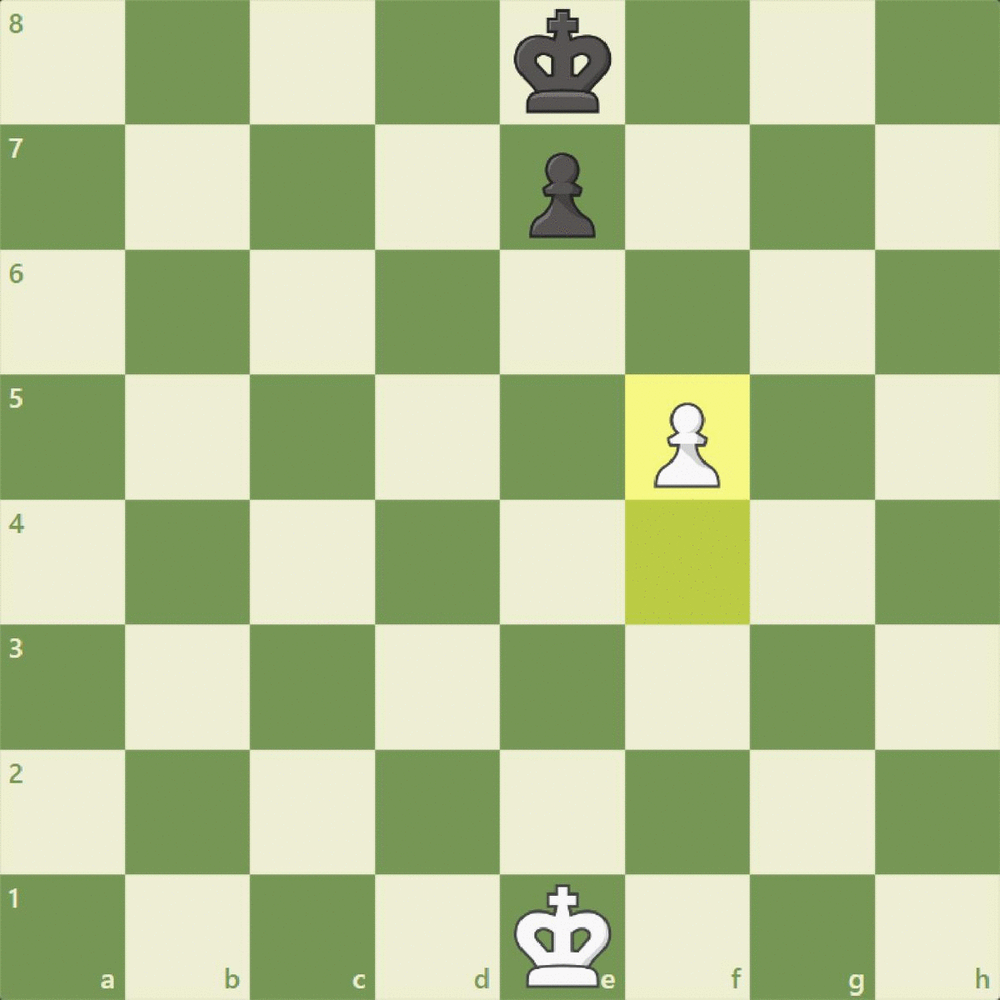
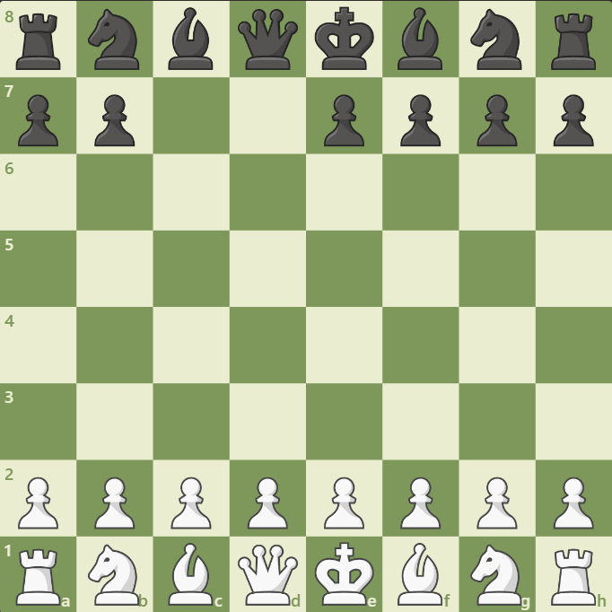
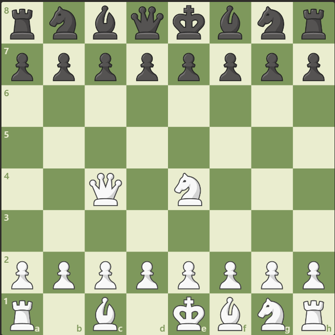

# Chess Java

### Castling
Đây là một nước đi quan trọng trong cờ vua, cho phép 2 quân cùng màu có thể tạo thành một nước cờ.

Để nhập thành được ta di chuyển quân vua sang bên trái or phải 2 ô, hoặc di chuyển vua lên trên quân xe mà bạn muốn nhập thành.Xe sẽ tự động nhảy qua và sang phía bên kia của vua!


Điều kiện để nhập thành:
- Quân vua chưa từng di chuyển (nếu có di chuyển và quay lại vị trí ban đầu cũng không được)
- Quân xe chưa từng di chuyển
- Trên đường đi giữa quân xe và vua không có quân cờ khác
- Quân vua không đang bị chiếu
- Nếu trên đường đi nhập thành mà bị chiếu thì cũng không được.


### En Passant
Kiểu bắt này là kiểu duy nhất trong cờ vua mà quân bắt không rơi vào cùng ô với nạn nhân của nó.
Để bắt quân tốt của đối thủ "en passant" cần đủ 3 điều kiện:
- Quân tốt của bạn phải đi được đúng 3 ô tính cả ô xuất phát.
- Quân tốt đối thủ phải vừa nhảy hai ô trong một nước đi.
- Bạn phải bắt quân tốt đối thủ ngay lượt đó. Nếu bạn bỏ qua, cơ hội "en passant" sẽ mất đi.

Nói cách khác, en passant cho phép bạn "phạt" nước đi tham lam của quân tốt đối thủ khi nó cố nhảy hai ô để chiếm lợi thế. Bạn bắt nó như thể nó chỉ đi một ô vậy.


### Checkmate
Checkmate xảy ra khi vua bị chiếu và không có nước đi nào thoát khỏi thế bị chiếu ấy.
Trong game này ta sẽ dùng 2 cách là checkmate và timeout để kết thúc ván đấu.
Nếu muốn hiểu hơn về các kiểu checkmate bạn có thể đọc thêm [ở đây](https://www.chess.com/terms/checkmate-chess).

### FEN và PGN
FEN: Chỉ lưu hình cờ tại một thời điểm nhất định.

PGN: Cung cấp đầy đủ thông tin của một ván đấu (tất cả các nước cờ, player1 player2,..)

```rnbqkbnr/pppppppp/8/8/8/8/PPPPPPPP/RNBQKBNR w KQkq - 0 1```
- Trong đó: 
- ```rnbqkbnr/pppppppp/8/8/8/8/PPPPPPPP/RNBQKBNR```: mô tả vị trí của các quân cờ trên bàn cờ được sắp xếp theo thứ tự từ trên xuống dưới chữ in thường là quân đen, in hoa là quân trắng, số là ô trống.
- ```w``` : quân trắng được đi trước.

- ```KQkq```: K cho phép quân trắng nhập thành ngắn, Q cho phép nhập thành dài và tượng tự với quân đen.
- ```-```: không có en passant.
- Để xoá một quân cờ: 
    - VD: Xoá một quân mã (black) ở vị trí [8][b]:    
    ```r1bqkbnr/pppppppp/8/8/8/8/PPPPPPPP/RNBQKBNR w KQkq - 0 1``` | 
    
    - VD: Xoá 2 quân tốt (black) ở vị trí [3][g] và [4][g]:
  
    ```rnbqkbnr/pp2pppp/8/8/8/8/PPPPPPPP/RNBQKBNR w KQkq - 0 1``` | 
- Để thêm quân cờ:
    - VD: Thêm một con tốt vào vị trí [6][c]:
  
    ```rnbqkbnr/pppppppp/2p5/8/8/8/PPPPPPPP/RNBQKBNR w KQkq - 0 1``` | 
    - VD: Di chuyển queen đến vị trí [4][c] và knight đến vị trí [4][e]:
    - 
    ```rnbqkbnr/pppppppp/8/8/2Q1N3/8/PPPPPPPP/R1B1KBNR w KQkq - 0 1``` | 

### Cách xây dựng các nước đi

1. Xác định quân cờ di chuyển:
Mỗi quân cờ có một ký tự riêng:
- K: Vua
- Q: Hậu
- R: Xe
- B: Tượng
- N: Mã
- P: Tốt
2. Xác định vị trí xuất phát:
- Ký tự chữ cái thể hiện cột xuất phát (a - h)
- Ký tự số thể hiện hàng xuất phát (1 - 8)
3. Xác định vị trí đến (nếu có):
- Tương tự như vị trí xuất phát, sử dụng ký tự chữ cái và số để xác định ô đến.
4. Ký hiệu đặc biệt:
- ```x``` : Ăn quân
- ```+``` : Chiếu Vua
- ```#``` : Chiếu hết
- ```=``` : promotion
- O-O: nhập thành ngắn
- O-O-O: nhập thành dài
5. Example
- fxe5 : quân tốt ở vị trí cột f ăn quân địch ở ví trí cột e hàng 5
- e5 : quân tốt di chuyển đến cột e hàng 5
- Nxg3 : quân mã ăn quân địch ở ví trí cột g hàng 3
- Bf6 : quân tượng di chuyển đến vị trí cột f hàng 6
- Qb5+ : Queen di chuyển đến vị trí cột b hàng 5 và chiếu tướng
