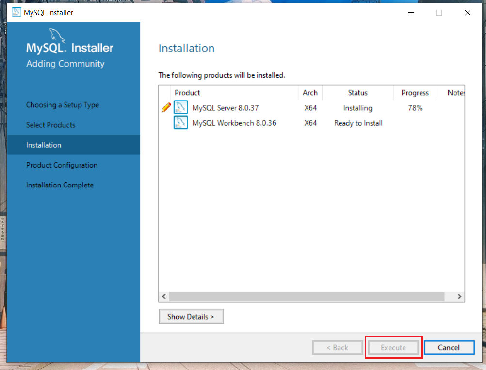

# Chess Java
### Download Mysql
Để vận hành được chương trình, điều đầu tiên cần phải có chính việc thiết lập kết nối với cơ sở dữ liệu MySQL. Bài viết này sẽ hướng dẫn bạn cách tải xuống mysql và tạo database đối với windows (còn hệ điều hành macos hay linux thì cũng tương tự):
1. Truy cập link: [https://www.mysql.com/products/workbench/](https://www.mysql.com/products/workbench/)


2. Nhấp vào tab ```DOWNLOADS```


3. Cuộn xuống và nhấp vào ```MySQL Community (GPL) Downloads```


4. Sau đấy bấm vào ```MySQL installer for Windows```


5. Chọn hệ điều hành và tải xuống tệp có kích thước lớn hơn


6. Sau khi tại xong nhấp đúp chuột vào tập tin cài đặt. Nó sẽ tải lại các thành phần cần thiết và mở cửa sổ như này. Chọn ```Custom``` rồi ```Next```


7. Click vào ```MySQL Server``` và ```MySQL Workbench``` chọn các bản mới nhất rồi nhấn mũi tên sang phải. Sau đấy nhấn ```Next```


8. Nhấp vào ```Execute``` để cài đặt hai thành phần cần thiết. Quá trình này có thể mất một chút thời gian tùy thuộc vào tốc độ internet và cấu hình máy tính của bạn.


9. Sau khi hoàn tất,nhấn ```Next```.


10. Nhấn ```Next```.


11. Nhấn ```Next```.


12. Bây giờ hãy cung cấp cho nó mật khẩu là ```admin``` hãy nhớ nhớ mật khẩu vì bạn sẽ cần nó khi muốn làm việc trong MySQL Workbench, rồi bấm ```Next```.


13. Chúng tôi muốn chạy dịch vụ dưới dạng Tài khoản hệ thống tiêu chuẩn cho hệ điều hành của mình. Do đó, hãy giữ nguyên mọi thứ và nhấn ```Next```.


14. Nhấn ```Next```.


15. Nhấn ```Execute```.


16. Sau đó, khi bạn nhận được hộp kiểm màu xanh lá cây trong tất cả các bước cấu hình, bạn chỉ cần nhấp vào ```Finish```


17. Cấu hình đã được áp dụng thành công, nhấn ```Next```


18. Nhấn ```Finish``` để hoàn tất cài đặt.


19. Bây giờ chúng ta cần cấu hình các biến đường dẫn cho hệ điều hành của mình. Đi tới ổ đĩa mà bạn đã cài đặt hệ điều hành Windows như đường dẫn bên dưới hình ảnh, nhấn vào ```MySQL Server 8.0```


20. Nhấn vào ```bin```


19. Copy path/address.


22. Bây giờ hãy mở ```Edit the system environment variables```


23. Nhấn ```Environment Variables```


24. Click đúp vào ```Path```


25. Bấm ```New``` và dán path/address mà bạn đã sao chép trước đó, rồi nhấn ```OK``` và ```OK``` tiếp.


26. Bây giờ bạn có thể mở MySQL Workbench, bấm vào cái ```Local instance```. Nó sẽ hỏi mật khẩu, nhập mật khẩu là ```admin``` và bấm ```save``` để sau này mở lên không cần quan tâm đến mật khẩu nữa.


27. Sau đấy bạn vào [resources/chess.sql](resources/chess.sql) copy đoạn mã và dán vào file Query, nhấn vào ```Execute```(hình tia sét) và thấy nó load có các tích xanh như hình dưới là bạn đã thành công tạo database.


28. Sắp xong rồi, giờ hãy kéo thanh cuộn lên và bấm vào nút ```Releases``` để tải xuống phiên bản mới nhất của game.


29. Sau khi tải xuống tệp ChessGame_v1.0.zip, bạn cần giải nén tệp này để tiếp tục.


30. Khởi chạy file jar ngay để bắt đầu chơi.


### Castling
Đây là một nước đi quan trọng trong cờ vua, cho phép 2 quân cùng màu có thể tạo thành một nước cờ.

Để nhập thành được ta di chuyển quân vua sang bên trái or phải 2 ô, hoặc di chuyển vua lên trên quân xe mà bạn muốn nhập thành.Xe sẽ tự động nhảy qua và sang phía bên kia của vua!


Điều kiện để nhập thành:
- Quân vua chưa từng di chuyển (nếu có di chuyển và quay lại vị trí ban đầu cũng không được)
- Quân xe chưa từng di chuyển
- Trên đường đi giữa quân xe và vua không có quân cờ khác
- Quân vua không đang bị chiếu
- Nếu trên đường đi nhập thành mà bị chiếu thì cũng không được.


### En Passant
Kiểu bắt này là kiểu duy nhất trong cờ vua mà quân bắt không rơi vào cùng ô với nạn nhân của nó.
Để bắt quân tốt của đối thủ "en passant" cần đủ 3 điều kiện:
- Quân tốt của bạn phải đi được đúng 3 ô tính cả ô xuất phát.
- Quân tốt đối thủ phải vừa nhảy hai ô trong một nước đi.
- Bạn phải bắt quân tốt đối thủ ngay lượt đó. Nếu bạn bỏ qua, cơ hội "en passant" sẽ mất đi.

Nói cách khác, en passant cho phép bạn "phạt" nước đi tham lam của quân tốt đối thủ khi nó cố nhảy hai ô để chiếm lợi thế. Bạn bắt nó như thể nó chỉ đi một ô vậy.


### Checkmate
Checkmate xảy ra khi vua bị chiếu và không có nước đi nào thoát khỏi thế bị chiếu ấy.

Trong game này ta sẽ dùng 2 cách là checkmate và timeout để kết thúc ván đấu.
Nếu muốn hiểu hơn về các kiểu checkmate bạn có thể đọc thêm [ở đây](https://www.chess.com/terms/checkmate-chess).

### FEN và PGN
FEN: Chỉ lưu hình cờ tại một thời điểm nhất định.

PGN: Cung cấp đầy đủ thông tin của một ván đấu (tất cả các nước cờ, player1 player2,..)

```rnbqkbnr/pppppppp/8/8/8/8/PPPPPPPP/RNBQKBNR w KQkq - 0 1```
- Trong đó: 
- ```rnbqkbnr/pppppppp/8/8/8/8/PPPPPPPP/RNBQKBNR```: mô tả vị trí của các quân cờ trên bàn cờ được sắp xếp theo thứ tự từ trên xuống dưới chữ in thường là quân đen, in hoa là quân trắng, số là ô trống.
- ```w``` : quân trắng được đi trước.

- ```KQkq```: K cho phép quân trắng nhập thành ngắn, Q cho phép nhập thành dài và tượng tự với quân đen.
- ```-```: không có en passant.
- Để xoá một quân cờ: 
    - VD: Xoá một quân mã (black) ở vị trí [8][b]:    
    ```r1bqkbnr/pppppppp/8/8/8/8/PPPPPPPP/RNBQKBNR w KQkq - 0 1``` | 
    
    - VD: Xoá 2 quân tốt (black) ở vị trí [3][g] và [4][g]:
  
    ```rnbqkbnr/pp2pppp/8/8/8/8/PPPPPPPP/RNBQKBNR w KQkq - 0 1``` | 
- Để thêm quân cờ:
    - VD: Thêm một con tốt vào vị trí [6][c]:
  
    ```rnbqkbnr/pppppppp/2p5/8/8/8/PPPPPPPP/RNBQKBNR w KQkq - 0 1``` | 
    - VD: Di chuyển queen đến vị trí [4][c] và knight đến vị trí [4][e]:
    - 
    ```rnbqkbnr/pppppppp/8/8/2Q1N3/8/PPPPPPPP/R1B1KBNR w KQkq - 0 1``` | 

### Cách xây dựng các nước đi

1. Xác định quân cờ di chuyển:
Mỗi quân cờ có một ký tự riêng:
- K: Vua
- Q: Hậu
- R: Xe
- B: Tượng
- N: Mã
- P: Tốt
2. Xác định vị trí xuất phát:
- Ký tự chữ cái thể hiện cột xuất phát (a - h)
- Ký tự số thể hiện hàng xuất phát (1 - 8)
3. Xác định vị trí đến (nếu có):
- Tương tự như vị trí xuất phát, sử dụng ký tự chữ cái và số để xác định ô đến.
4. Ký hiệu đặc biệt:
- ```x``` : Ăn quân
- ```+``` : Chiếu Vua
- ```#``` : Chiếu hết
- ```=``` : promotion
- O-O: nhập thành ngắn
- O-O-O: nhập thành dài
5. Example
- fxe5 : quân tốt ở vị trí cột f ăn quân địch ở ví trí cột e hàng 5
- e5 : quân tốt di chuyển đến cột e hàng 5
- Nxg3 : quân mã ăn quân địch ở ví trí cột g hàng 3
- Bf6 : quân tượng di chuyển đến vị trí cột f hàng 6
- Qb5+ : Queen di chuyển đến vị trí cột b hàng 5 và chiếu tướng
