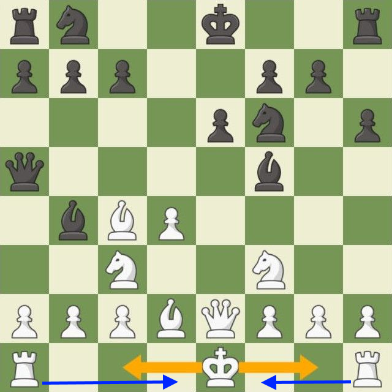

# Chess Java

### Castling
Đây là một nước đi quan trọng trong cờ vua, cho phép 2 quân cùng màu có thể tạo thành một nước cờ.

Để nhập thành được ta di chuyển quân vua sang bên trái or phải 2 ô, hoặc di chuyển vua lên trên quân xe mà bạn muốn nhập thành.Xe sẽ tự động nhảy qua và sang phía bên kia của vua!



Điều kiện để nhập thành:
- Quân vua chưa từng di chuyển (nếu có di chuyển và quay lại vị trí ban đầu cũng không được)
- Quân xe chưa từng di chuyển
- Trên đường đi giữa quân xe và vua không có quân cờ khác
- Quân vua không đang bị chiếu
- Nếu trên đường đi nhập thành mà bị chiếu thì cũng không được.


### FEN và PGN
FEN: Chỉ lưu hình cờ tại một thời điểm nhất định.
PGN: Cung cấp đầy đủ thông tin của một ván đấu (tất cả các nước cờ, player1 player2,..)

```rnbqkbnr/pppppppp/8/8/8/8/PPPPPPPP/RNBQKBNR w KQkq - 0 1```
- Trong đó: 
- ```rnbqkbnr/pppppppp/8/8/8/8/PPPPPPPP/RNBQKBNR```: mô tả vị trí của các quân cờ trên bàn cờ được sắp xếp theo thứ tự từ trên xuống dưới chữ in thường là quân đen, in hoa là quân trắng.
- ```w``` : quân trắng được đi trước.

- ```KQkq```: K cho phép quân trắng nhập thành ngắn, Q cho phép nhập thành dài và tượng tự với quân đen.
- ```0```: không có en passant.
- ```1```: số lượng bán nước đi đã được thực hiện trong ván cờ.
- Để xoá một quân cờ: 
    - VD: Xoá một quân mã (black) ở vị trí [8][b]:    
    ```r1bqkbnr/pppppppp/8/8/8/8/PPPPPPPP/RNBQKBNR w KQkq - 0 1``` 
    
    - VD: Xoá 2 quân tốt (black) ở vị trí [3][g] và [4][g]:
  
    ```rnbqkbnr/pp2pppp/8/8/8/8/PPPPPPPP/RNBQKBNR w KQkq - 0 1``` 
- Để thêm quân cờ:
    - VD: Thêm một con tốt vào vị trí [6][c]:
  
    ```rnbqkbnr/pppppppp/2p5/8/8/8/PPPPPPPP/RNBQKBNR w KQkq - 0 1``` 
    - VD: Di chuyển queen đến vị trí [4][c] và knight đến vị trí [4][e]:
    ```rnbqkbnr/pppppppp/8/8/2Q1N3/8/PPPPPPPP/R1B1KBNR w KQkq - 0 1``` 
