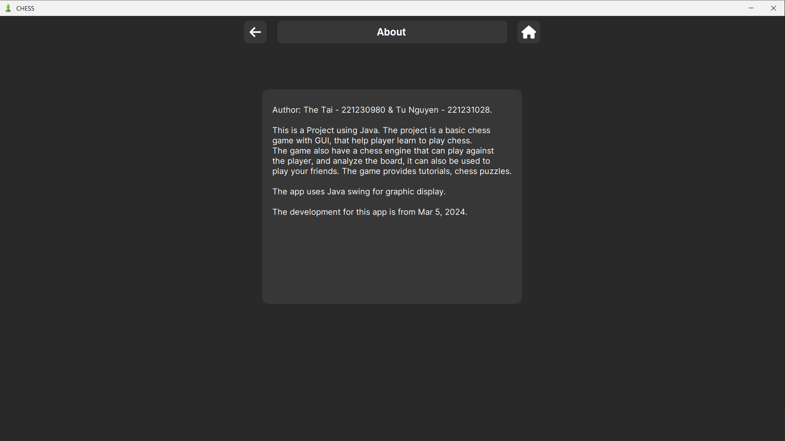
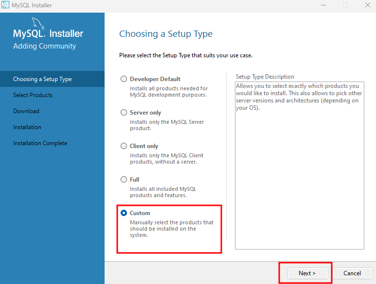

# Chess Game with AI and Alpha-Beta Pruning

## 1. Project Description

This is a basic chess game built using Java and Java Swing, designed to help players learn and play chess. The game features a chess engine powered by the Alpha-Beta Pruning algorithm, allowing it to compete against players and analyze the game board for better strategy. The game provides an interactive platform for both beginners and experienced players, offering tutorials, chess puzzles, and multiplayer support.

## 2. Features

- [x] **Graphical User Interface (GUI):** Developed using Java Swing, offering an intuitive interface for players to easily learn and play chess.
- [x] **Chess Engine:** Integrated with a chess engine that uses the Alpha-Beta Pruning algorithm for analyzing game moves and competing against players.
- [x] **Multiplayer Support:** Play against friends or other players through a multiplayer mode.
- [x] **Tutorials and Chess Puzzles:** Provides educational resources to help players improve their chess skills.
- [x] **Match History:** Tracks and displays all moves made during a game, allowing players to review and analyze their performance.
- [x] **Customizable Appearance:** Designed to be user-friendly, allowing players to change the appearance of the chess pieces and game board for a personalized experience.
- [x] **Interactive Learning Environment:** Focused on delivering an engaging and educational platform suitable for both beginners and experienced players.

## 3. Screenshots

- Menu
  
- Game
  
  
  
- Puzzle
  
  
  
  
- Settings
  
- History
  
  
  
- About
  

## 4. How to run

### 4.1. Build from source

- Clone the repository.
- Open the project in IntelliJ IDEA.
- Build the project.
- Run the executable file.

### 4.2. Run the executable file

- Download the `ChessGame_vx.x.zip` file from a release [here](https://github.com/tunguyen1104/chess-java/releases).
- Download MySQL and executable [chess.sql](resources/chess.sql)
- Extract the zip file.
- Run the `ChessGame.jar` file.

  
Click here to view the detail installation steps

1. Truy cập link: [https://www.mysql.com/products/workbench/](https://www.mysql.com/products/workbench/)

1. Nhấp vào tab `DOWNLOADS`
   

1. Cuộn xuống và nhấp vào `MySQL Community (GPL) Downloads`
   

1. Sau đấy bấm vào `MySQL installer for Windows`
   

1. Chọn hệ điều hành và tải xuống tệp có kích thước lớn hơn
   

1. Sau khi tải xong nhấp đúp chuột vào tập tin cài đặt. Nó sẽ tải lại các thành phần cần thiết và mở cửa sổ như này. Chọn `Custom` rồi `Next`
   

1. Click vào `MySQL Server` và `MySQL Workbench` chọn các bản mới nhất rồi nhấn mũi tên sang phải. Sau đấy nhấn `Next`
   

1. Nhấp vào `Execute` để cài đặt hai thành phần cần thiết. Quá trình này có thể mất một chút thời gian tùy thuộc vào tốc độ internet và cấu hình máy tính của bạn.
   

1. Sau khi hoàn tất,nhấn `Next`.
   

1. Nhấn `Next`.
   

1. Nhấn `Next`.
   

1. Bây giờ hãy cung cấp cho nó mật khẩu là `admin` hãy nhớ nhớ mật khẩu vì bạn sẽ cần nó khi muốn làm việc trong MySQL Workbench, rồi bấm `Next`.
   

1. Chúng tôi muốn chạy dịch vụ dưới dạng Tài khoản hệ thống tiêu chuẩn cho hệ điều hành của mình. Do đó, hãy giữ nguyên mọi thứ và nhấn `Next`.
   

1. Nhấn `Next`.
   

1. Nhấn `Execute`.
   

1. Sau đó, khi bạn nhận được hộp kiểm màu xanh lá cây trong tất cả các bước cấu hình, bạn chỉ cần nhấp vào `Finish`
   

1. Cấu hình đã được áp dụng thành công, nhấn `Next`
   

1. Nhấn `Finish` để hoàn tất cài đặt.
   

1. Bây giờ chúng ta cần cấu hình các biến đường dẫn cho hệ điều hành của mình. Đi tới ổ đĩa mà bạn đã cài đặt hệ điều hành Windows như đường dẫn bên dưới hình ảnh, nhấn vào `MySQL Server 8.0`
   

1. Nhấn vào `bin`
   

1. Copy path/address.
   

1. Bây giờ hãy mở `Edit the system environment variables`
   

1. Nhấn `Environment Variables`
   

1. Click đúp vào `Path`
   

1. Bấm `New` và dán path/address mà bạn đã sao chép trước đó, rồi nhấn `OK` và `OK` tiếp.
   

1. Bây giờ bạn có thể mở MySQL Workbench, bấm vào cái `Local instance`. Nó sẽ hỏi mật khẩu, nhập mật khẩu là `admin` và bấm `save` để sau này mở lên không cần quan tâm đến mật khẩu nữa.
   

1. Sau đấy bạn vào [resources/chess.sql](resources/chess.sql) copy đoạn mã và dán vào file Query, nhấn `Execute`(hình tia sét) và thấy nó load có các tích xanh như hình dưới là bạn đã thành công tạo database.
   

1. Sắp xong rồi, giờ hãy bấm vào nút `Releases` để tải xuống phiên bản mới nhất của game.
   

1. Sau khi tải xuống tệp ChessGame_v1.0.zip, bạn cần giải nén tệp này để tiếp tục.
   

1. Khởi chạy file jar ngay để bắt đầu chơi.

## 5. References

- [Chess Programming Wiki](https://www.chessprogramming.org/Main_Page)
- [Ameye's blog](https://ameye.dev/notes/chess-engine/)
- [Lichess puzzle database](https://www.kaggle.com/datasets/reinism/lichess-database-puzzles)
- [Lichess themes](https://github.com/lichess-org/lila/tree/master/public)
- [Chess.com sound effects](https://www.chess.com/forum/view/general/chessboard-sound-files)

## 6. Notes

### FEN và PGN

FEN: Chỉ lưu hình cờ tại một thời điểm nhất định.

PGN: Cung cấp đầy đủ thông tin của một ván đấu (tất cả các nước cờ, player1 player2,..)

`rnbqkbnr/pppppppp/8/8/8/8/PPPPPPPP/RNBQKBNR w KQkq - 0 1`

- Trong đó:
- `rnbqkbnr/pppppppp/8/8/8/8/PPPPPPPP/RNBQKBNR`: mô tả vị trí của các quân cờ trên bàn cờ được sắp xếp theo thứ tự từ trên xuống dưới chữ in thường là quân đen, in hoa là quân trắng, số là ô trống.
- `w` : quân trắng được đi trước.

- `KQkq`: K cho phép quân trắng nhập thành ngắn, Q cho phép nhập thành dài và tượng tự với quân đen.
- `-`: không có en passant.
- Để xoá một quân cờ:

  - VD: Xoá một quân mã (black) ở vị trí [8][b]:  
  `r1bqkbnr/pppppppp/8/8/8/8/PPPPPPPP/RNBQKBNR w KQkq - 0 1`
  

  - VD: Xoá 2 quân tốt (black) ở vị trí [3][g] và [4][g]:
  `rnbqkbnr/pp2pppp/8/8/8/8/PPPPPPPP/RNBQKBNR w KQkq - 0 1`
  

- Để thêm quân cờ:

  - VD: Thêm một con tốt vào vị trí [6][c]:
  `rnbqkbnr/pppppppp/2p5/8/8/8/PPPPPPPP/RNBQKBNR w KQkq - 0 1`
  

  - VD: Di chuyển queen đến vị trí [4][c] và knight đến vị trí [4][e]:
  `rnbqkbnr/pppppppp/8/8/2Q1N3/8/PPPPPPPP/R1B1KBNR w KQkq - 0 1`
  

### Cách xây dựng các nước đi

1. Xác định quân cờ di chuyển:
   Mỗi quân cờ có một ký tự riêng:

- K: Vua
- Q: Hậu
- R: Xe
- B: Tượng
- N: Mã
- P: Tốt

2. Xác định vị trí xuất phát:

- Ký tự chữ cái thể hiện cột xuất phát (a - h)
- Ký tự số thể hiện hàng xuất phát (1 - 8)

3. Xác định vị trí đến (nếu có):

- Tương tự như vị trí xuất phát, sử dụng ký tự chữ cái và số để xác định ô đến.

4. Ký hiệu đặc biệt:

- `x` : Ăn quân
- `+` : Chiếu Vua
- `#` : Chiếu hết
- `=` : promotion
- O-O: nhập thành ngắn
- O-O-O: nhập thành dài

5. Example

- fxe5 : quân tốt ở vị trí cột f ăn quân địch ở ví trí cột e hàng 5
- e5 : quân tốt di chuyển đến cột e hàng 5
- Nxg3 : quân mã ăn quân địch ở ví trí cột g hàng 3
- Bf6 : quân tượng di chuyển đến vị trí cột f hàng 6
- Qb5+ : Queen di chuyển đến vị trí cột b hàng 5 và chiếu tướng
